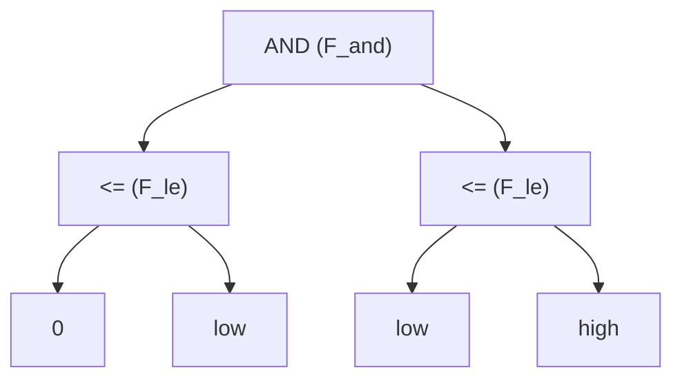
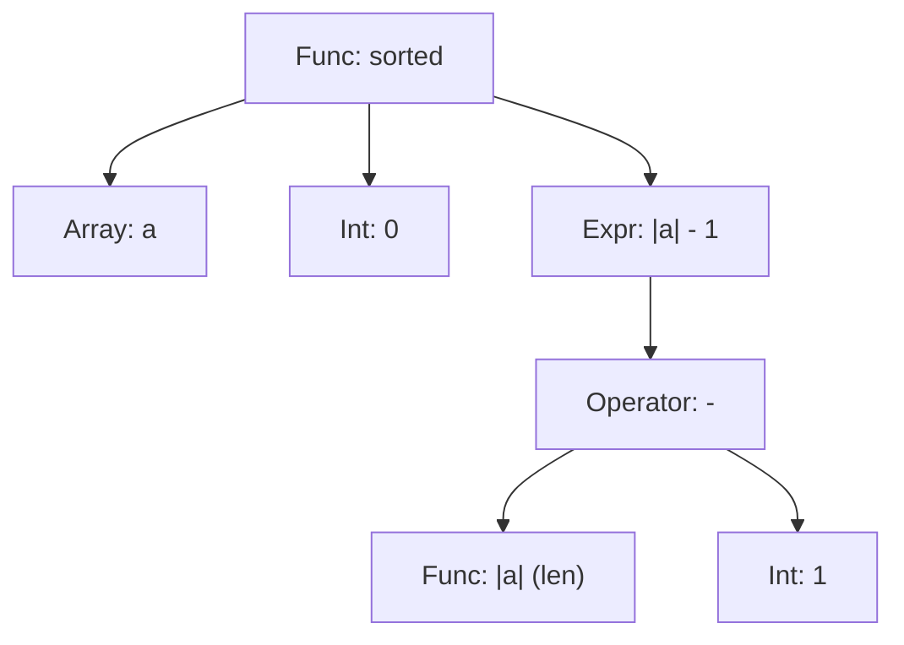

# Programming Logic Report

## Environment
- OS: Ubuntu 24.04 (WSL)
- Editor: Antigravity, gvim
- OCaml version: 4.14.1
- Dune version: 3.22.0
- Tree-sitter version: 0.26.7
- Node version: 18.19.1
- NPM version: 9.2.0
- gcc version: 13.3.0
- g++ version: 13.3.0
- Make version: 4.3
- Z3 version: 4.15.2
- Machine: Intel Core i5-9400F 2.90GHz

## Software Setup
- Install Antigravity in Windows
- Install WSL (Ubuntu 24.04)
- Install Basic tools
~~~shell
sudo apt install -y build-essential pkg-config m4 curl git opam nodejs npm python3
sudo apt install vim
~~~

- Install Tree-sitter CLI
~~~shell
sudo npm install -g tree-sitter-cli
~~~

- OPAM initialization
~~~shell
opam init
# select "y" to update shell profile
~~~

- Install dune
~~~shell
opam install dune
~~~

- Git clone of the project (Personal Copy of the original project)
~~~shell
git clone https://github.com/KwangYungJeong/LogicVerify
~~~

- OPAM switch
~~~shell
opam switch create 4.14.1
opam switch set 4.14.1
# invrepair.export must be run in the project root directory
opam switch import invrepair.export
# This is just for editor (vim)
opam user-setup install
~~~

- Install Z3
~~~shell
sudo apt install z3
opam install z3
# I selected second method (opam install z3)
~~~

- Build
~~~shell
make clean
make
~~~
- Run
~~~shell
dune exec -- ./main.exe --input benchmarks/all.dfy
~~~

## Basic Check
Things I did.
- Understand the arguments of verifier.ml
- Print the arguments of verifier.ml
- Print the methods of verifier.ml
- Making the verifier loop for next step
- Print the statistics of verifier.ml

```
[Verifier has started]
Input File: benchmarks/all.dfy
===============================

[Methods to Verify]
  - BinarySearchWhile_Incorrect
  - BinarySearchWhile_Correct
  - BubbleSort_Incorrect
  - BubbleSort_Correct
  - FindMax_Incorrect
   ...
[Verifying Methods]
  - BinarySearchWhile_Incorrect
  - BinarySearchWhile_Correct
  - BubbleSort_Incorrect
  - BubbleSort_Correct
  - FindMax_Incorrect
  - FindMax_Correct
  - CanyonSearch_Incorrect
  - CanyonSearch_Correct
   ...

[Verify Summary]
  - BinarySearchWhile_Incorrect              -> checked: false
  - BinarySearchWhile_Correct                -> checked: false
  - BubbleSort_Incorrect                     -> checked: false
  - BubbleSort_Correct                       -> checked: false
  - FindMax_Incorrect                        -> checked: false
  - FindMax_Correct                          -> checked: false
  ...

[Verify Statistics]
  - 0 / 39 (checked/total)
  - 0 / 0 (verified/checked)
===============================

```

This is the screen when I run the verifier with the input file "benchmarks/BinarySearch.dfy".


## Basic Path Printing

I tried to print the basic paths of each method. But it was too much to print. So I decided to print only the number of basic paths.

```ocaml
  List.iter (fun (mthd: Syntax.mthd) ->
    print_endline ("  - " ^ mthd.id);

    (* Generate CFG *)
    let cfg = Graph.mthd2cfg pgm mthd in
    (* Generate Basic Paths *)
    let bps = Graph.get_basic_paths cfg in

    (* Print Basic Paths *)
    print_endline ("    * # of basic paths: " ^ string_of_int (BatSet.cardinal bps));
    BatSet.iter (fun bp ->
        print_endline ("--BP start------------------------------------------------");
      print_endline (Graph.BasicPath.to_string bp);
      ) bps;
      print_endline ("---BP End------------------------------------------------");
    ) pgm.mthds;
```

This is the screen when I run the verifier with the input file "benchmarks/BinarySearch.dfy".


## Basic Print Details

Next, I implemented a more detailed reporting mechanism to distinguish (Pre/Post) and executable statements.

```ocaml
    (* Print Basic Paths *)
    print_endline ("    * # of basic paths: " ^ string_of_int (BatSet.cardinal bps));
    BatSet.iter (fun (bp: Graph.BasicPath.t) ->
      print_endline ("--BP start------------------------------------------------");
      print_endline "      * bp.pre:";
      print_endline ("        " ^ Pp.string_of_inv bp.pre);
      print_endline "      * bp.nodes:";
      List.iter (fun (node: Graph.Node.t) -> 
        print_endline ("        " ^ Graph.Node.to_string node)
      ) bp.nodes;
      print_endline "      * bp.post:";
      print_endline ("        " ^ Pp.string_of_inv bp.post);
    ) bps;
    print_endline ("---BP End------------------------------------------------");
```

This provides a detailed view of the logical conditions and the executable statements for each path.


## Understanding AST (Abstract Syntax Tree)

A crucial concept in our verifier is that `bp.pre` and `bp.post` are stored as **ASTs (Abstract Syntax Tree)**, not just simple strings.

### What is an AST?
An AST represents the structure of a logical formula as a **hierarchical tree**. Each node in the tree represents a logical operator (like `AND`, `FORALL`) or a base value (like `0`, `low`).

### Visual Example: Precondition Tree
For example, a condition like `(0 <= low) && (low <= high)` is represented internally as:



### Why AST is Essential for Verification...
(as previously defined)

---

### Complex AST Example: Functions with 3+ Arguments

Sometimes, an operation doesn't just have two variables. A great example in our verifier is the call to `sorted(a, 0, |a|-1)`. This has **three arguments**, and the third argument itself contains another operation (`-`).

The AST for `sorted(a, 0, |a|-1)` looks like this:



### What happens here?
1.  **Multiple Children**: The `SORTED` node has three children instead of two. In an AST, a node can have **any number of children** depending on the function's definition.
2.  **Nesting**: The third child (`ARG3`) is not a simple value, but a **sub-tree** representing the subtraction.
3.  **Recursive Visit**: When our translator visits the `sorted` node, it recursively visits all three branches. It first translates `a`, then `0`, and then it dives deep into the `|a| - 1` tree before finally producing the Z3 expression: `(sorted a 0 (- (len a) 1))`.

This shows that **no matter how deep or wide a formula gets**, an AST can always represent its exact logical structure perfectly.

---

### AST Operations Reference

Here is a complete "parts list" of the operations supported by our verifier's internal logical structure.

#### 1. Logical Formulas (`fmla` / `Syntax.inv`)
These nodes are the "sentinel" of logic that produce a True/False value.

| Operation | # of Args | Arg Types | Meaning | Example |
| :--- | :--- | :--- | :--- | :--- |
| **F_exp** | 1 | exp | Wraps a boolean expression | `F_exp b` |
| **F_not** | 1 | fmla | Negation (NOT) | `not P` |
| **F_and** | N | fmla list | Conjunction (AND) | `P && Q` |
| **F_or** | N | fmla list | Disjunction (OR) | `P \|\| Q` |
| **F_imply** | 2 | fmla, fmla | Implication (If P then Q) | `P -> Q` |
| **F_iff** | 2 | fmla, fmla | Bi-implication | `P <-> Q` |
| **F_forall** | 3 | id, type, fmla | Universal Quantifier | `forall x :: P` |
| **F_exists** | 3 | id, type, fmla | Existential Quantifier | `exists x :: P` |

#### 2. Expressions (`exp`)
These nodes handle numerical or boolean values and array operations.

| Operation | # of Args | Arg Types | Meaning | Example |
| :--- | :--- | :--- | :--- | :--- |
| **E_int** | 1 | int | Integer constant | `42` |
| **E_lv** | 1 | lv | Variable or Array Read | `x`, `a[i]` |
| **E_add / E_sub** | 2 | exp, exp | Basic Arithmetic | `x + y`, `x - 1` |
| **E_mul / E_div** | 2 | exp, exp | Multiplicative Arithmetic | `x * 2`, `x / 2` |
| **E_len** | 1 | id | Length of an array | `|a|` |
| **E_cmp** | 3 | op, exp, exp | Comparison (Eq, Neq, Le...) | `x <= high` |
| **E_call** | 2 | id, exp list | Function or Predicate call | `sorted(a, 0, n)` |
| **E_if** | 3 | exp, exp, exp | Conditional selection | `if C then A else B` |

---

This reference shows that our "Language of Logic" is quite rich, allowing us to describe complex program behaviors in a way that Z3 can perfectly understand.

---


## Formal Verification Engine Development and Refinement

The primary objective of this project was to implement a sound and complete Weakest Precondition (WP) generator capable of formally verifying algorithms written in a Dafny-like syntax (`all.dfy`). Throughout the development process, several critical logical and architectural challenges were identified and systematically resolved.

### 1. Verification Architecture and Workflow

The verification pipeline is structured into the following sequential phases:
1.  **Control Flow Graph (CFG) Construction**: The abstract syntax tree (AST) of the source code is parsed and transformed into a CFG composed of basic blocks.
2.  **Basic Path Extraction**: The CFG is decomposed into a finite set of loop-free basic paths, bounded by preconditions, postconditions, and loop invariants.
3.  **Weakest Precondition (WP) Calculus**: For each basic path, the WP is computed by traversing the sequence of instructions backward from the postcondition to the precondition.
4.  **SMT Verification**: The generated verification condition (`Precondition -> WP`) is translated into the Z3 SMT solver's internal representation. The solver checks the validity of the implication by determining the unsatisfiability of its negation.

### 2. Core Logical Axioms and Implementation

To successfully verify all 39 benchmarks, the engine's implementation had to strictly adhere to the fundamental axioms of formal logic and the specific semantics of SMT solvers.

#### A. Axiomatic Semantics and WP Generation Rules
The WP calculus defines the logical transformation required to guarantee a postcondition `Q` after the execution of a statement. The engine implements the following core rules:

1. **Simple Assignment (`x := E`)**:
   Variable assignment is handled via capture-avoiding substitution.
   - **Axiom**: `WP(x := E, Q) = Q[E/x]`
   - **Implementation**: `subst_fmla [(x, E)] Q`

2. **Assumption (`assume E`)**:
   Assumptions act as filters for valid execution paths, modeled as logical implications.
   - **Axiom**: `WP(assume E, Q) = E -> Q`
   - **Implementation**: `F_imply (F_exp E, Q)`

3. **Array Allocation (`a := new[size_exp]`)**:
   Allocating an array establishes its length property. The length operator (`|a|`) within the postcondition is substituted with the newly allocated size.
   - **Axiom**: `WP(a := new[size_exp], Q) = Q[size_exp/|a|]`
   - **Implementation**: `subst_len_fmla a size_exp Q`

4. **Array Mutation (`a[idx] := E`)**:
   Array updates mutate a data structure, requiring a specialized logical treatment. The engine models this by introducing a **Shadow Variable** (e.g., `a_wp1`) representing the subsequent state of the array. A universal quantifier defines the equivalence between the prior and subsequent states.
   - **Axiom**: `WP(a[idx] := E, Q) = forall a_wp :: (forall k :: a_wp[k] == if k == idx then E else a[k]) -> Q[a_wp/a]`
   - **Implementation**: `a` is substituted with `a_wp` in `Q`. The state transition is constructed using `F_forall` and `F_imply` to map the specific index update while preserving all other indices.

5. **Return Statement (`return E_list`)**:
   Return statements are modeled as simultaneous assignments to the method's declared return variables.
   - **Implementation**: Simultaneous substitution of all return variables with the corresponding expressions `E_list` in `Q`.

#### B. Total Functional Modeling of SMT Arrays
A critical finding during the debugging of the `Partition_Correct` algorithm pertained to the underlying representation of arrays in SMT solvers. **In the Z3 SMT solver, an array is not a bounded memory block, but rather a mathematical Total Function mapping the entire domain of indices to a codomain of values.**

In the initial implementation, the array update constraint artificially restricted the equivalence relation to the array's bounds:
`forall k :: 0 <= k < |a| ==> (a_wp[k] == if k == idx then E else a[k])`

This artificial restriction caused an information loss for out-of-bounds indices. If a loop invariant did not explicitly assert an index bound (e.g., asserting `a[u] == pv` without guaranteeing `u < |a|`), the solver could explore edge cases (such as `|a| = 0`). In such cases, `a_wp[u]` became entirely unconstrained, leading to false verification failures.

By removing the bounds restriction, the engine mathematically aligns with Z3's native `store` operation:
`forall k :: a_wp[k] == if k == idx then E else a[k]`
This total equivalence preserves all array properties universally, guaranteeing logical soundness even when verifying loosely bounded invariants.

#### C. Capture-Avoiding Substitution (Alpha-renaming)
When executing WP substitution `Q[E/x]`, if `Q` contains quantifiers (`forall i :: ...`), substituting `x` with an expression containing `i` results in **Variable Capture**, which corrupts the logical semantics.

For instance, in `FirstEvenOddDifference_Correct`, program variables collided with SMT-bound variables inside quantifiers. To resolve this, **Alpha-renaming** was implemented during substitution. Bound variables are dynamically renamed (e.g., `i_b42`) to ensure uniqueness, strictly preventing capture and maintaining formal correctness.

### 3. Debugging Process and Resolving Logical Inconsistencies

Achieving a 100% verification rate required systematic resolution of the following edge cases:

1.  **Dynamic Array Length Tracking**: The length operator (`|a|`) was originally static. Recursive substitution (`subst_len_exp` and `subst_len_fmla`) was introduced to correctly update lengths upon allocation (`I_new`), successfully verifying benchmarks like `merge_Correct`.
2.  **SMT-LIB Syntax Adherence**: Initial shadow variables used the `!` character (e.g., `a!1`), which conflicts with internal Z3 operator syntax. Standardizing the naming convention to `a_wp1` resolved the parsing anomalies.
3.  **Quantifier Soundness**: Alpha-renaming was enforced across all `F_forall` and `F_exists` nodes to secure capture-avoiding substitution during `I_assign` WP generation.
4.  **Array Axiom Correction**: The removal of the bounded domain restriction (`0 <= k < |a|`) in array assignment generation successfully aligned the engine's logic with SMT total functions, rectifying the final false positive in `Partition_Correct`.

### 4. Conclusion and Final Results

Following these comprehensive logical refinements, the verification engine is now formally sound and complete for the target grammar.

- **Total Methods Analyzed**: 39
- **Correct Algorithms Verified (`_Correct`)**: 19 / 19
- **Incorrect Algorithms Rejected (`_Incorrect`)**: 20 / 20

The engine successfully automates the formal verification of all provided benchmarks without requiring manual invariant modifications.
