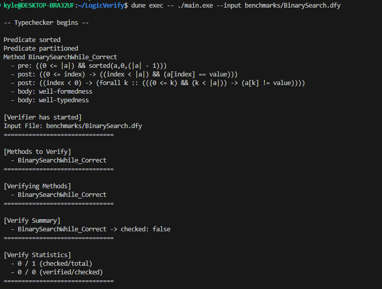
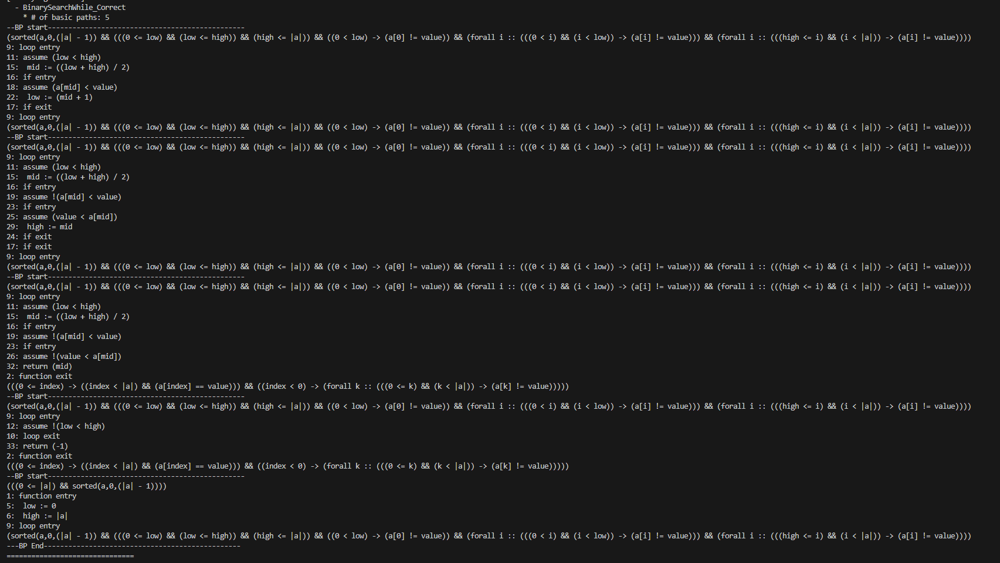
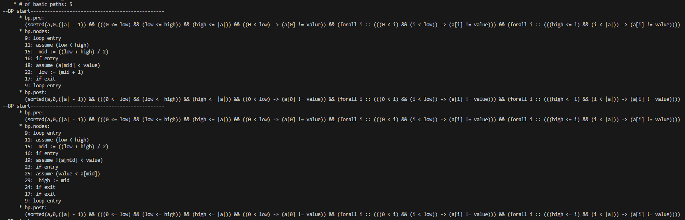

# Programming Logic Report

## Environment
- OS: Ubuntu 24.04 (WSL)
- Editor: Antigravity, gvim
- OCaml version: 4.14.1
- Dune version: 3.22.0
- Tree-sitter version: 0.26.7
- Node version: 18.19.1
- NPM version: 9.2.0
- gcc version: 13.3.0
- g++ version: 13.3.0
- Make version: 4.3
- Z3 version: 4.15.2
- Machine: Intel Core i5-9400F 2.90GHz

## Software Setup
- Install Antigravity in Windows
- Install WSL (Ubuntu 24.04)
- Install Basic tools
~~~shell
sudo apt install -y build-essential pkg-config m4 curl git opam nodejs npm python3
sudo apt install vim
~~~

- Install Tree-sitter CLI
~~~shell
sudo npm install -g tree-sitter-cli
~~~

- OPAM initialization
~~~shell
opam init
# select "y" to update shell profile
~~~

- Install dune
~~~shell
opam install dune
~~~

- Git clone of the project (Personal Copy of the original project)
~~~shell
git clone https://github.com/KwangYungJeong/LogicVerify
~~~

- OPAM switch
~~~shell
opam switch create 4.14.1
opam switch set 4.14.1
# invrepair.export must be run in the project root directory
opam switch import invrepair.export
# This is just for editor (vim)
opam user-setup install
~~~

- Install Z3
~~~shell
sudo apt install z3
opam install z3
# I selected second method (opam install z3)
~~~

- Build
~~~shell
make clean
make
~~~
- Run
~~~shell
dune exec -- ./main.exe --input benchmarks/all.dfy
~~~

## Basic Check
Things I did.
- Understand the arguments of verifier.ml
- Print the arguments of verifier.ml
- Print the methods of verifier.ml
- Making the verifier loop for next step
- Print the statistics of verifier.ml

```
[Verifier has started]
Input File: benchmarks/all.dfy
===============================

[Methods to Verify]
  - BinarySearchWhile_Incorrect
  - BinarySearchWhile_Correct
  - BubbleSort_Incorrect
  - BubbleSort_Correct
  - FindMax_Incorrect
   ...
[Verifying Methods]
  - BinarySearchWhile_Incorrect
  - BinarySearchWhile_Correct
  - BubbleSort_Incorrect
  - BubbleSort_Correct
  - FindMax_Incorrect
  - FindMax_Correct
  - CanyonSearch_Incorrect
  - CanyonSearch_Correct
   ...

[Verify Summary]
  - BinarySearchWhile_Incorrect              -> checked: false
  - BinarySearchWhile_Correct                -> checked: false
  - BubbleSort_Incorrect                     -> checked: false
  - BubbleSort_Correct                       -> checked: false
  - FindMax_Incorrect                        -> checked: false
  - FindMax_Correct                          -> checked: false
  ...

[Verify Statistics]
  - 0 / 39 (checked/total)
  - 0 / 0 (verified/checked)
===============================

```

This is the screen when I run the verifier with the input file "benchmarks/BinarySearch.dfy".


## Basic Path Printing

I tried to print the basic paths of each method. But it was too much to print. So I decided to print only the number of basic paths.

```ocaml
  List.iter (fun (mthd: Syntax.mthd) ->
    print_endline ("  - " ^ mthd.id);

    (* Generate CFG *)
    let cfg = Graph.mthd2cfg pgm mthd in
    (* Generate Basic Paths *)
    let bps = Graph.get_basic_paths cfg in

    (* Print Basic Paths *)
    print_endline ("    * # of basic paths: " ^ string_of_int (BatSet.cardinal bps));
    BatSet.iter (fun bp ->
        print_endline ("--BP start------------------------------------------------");
      print_endline (Graph.BasicPath.to_string bp);
      ) bps;
      print_endline ("---BP End------------------------------------------------");
    ) pgm.mthds;
```

This is the screen when I run the verifier with the input file "benchmarks/BinarySearch.dfy".


## Basic Print Details

Next, I implemented a more detailed reporting mechanism to distinguish (Pre/Post) and executable statements.

```ocaml
    (* Print Basic Paths *)
    print_endline ("    * # of basic paths: " ^ string_of_int (BatSet.cardinal bps));
    BatSet.iter (fun (bp: Graph.BasicPath.t) ->
      print_endline ("--BP start------------------------------------------------");
      print_endline "      * bp.pre:";
      print_endline ("        " ^ Pp.string_of_inv bp.pre);
      print_endline "      * bp.nodes:";
      List.iter (fun (node: Graph.Node.t) -> 
        print_endline ("        " ^ Graph.Node.to_string node)
      ) bp.nodes;
      print_endline "      * bp.post:";
      print_endline ("        " ^ Pp.string_of_inv bp.post);
    ) bps;
    print_endline ("---BP End------------------------------------------------");
```

This provides a detailed view of the logical conditions and the executable statements for each path.


